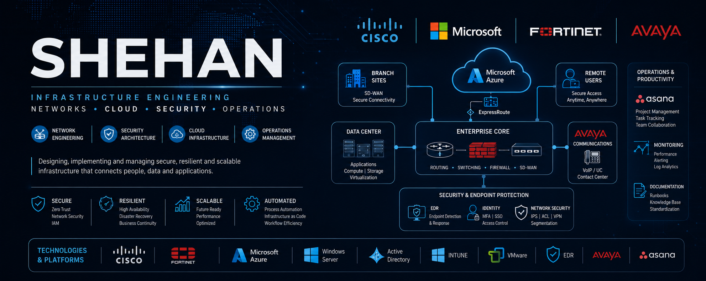

https://raw.githubusercontent.com/shehanau/shehanau/main/images/banner.png

# Shehan 

### Infrastructure • Networking • Cloud • Security

Infrastructure and Cloud Engineer with experience delivering enterprise networking, cloud migration, security, and operational technology projects across government, education, healthcare, and commercial environments.

---

## Current Portfolio

### Secure Hybrid Fabric

Enterprise architecture portfolio covering:

- Network Underlay
- Security Overlay
- Cloud Extensions
- Endpoint Control
- Operations Management

---

## Technologies

### Networking
Cisco • Fortinet • SD-WAN • BGP • VLANs • QoS • VPN

### Cloud
Azure • AWS • Microsoft 365 • Entra ID

### Security
IAM • ACLs • IPS • MFA • Conditional Access

### Systems
Windows Server • VMware • Hyper-V • Active Directory

### Endpoint Management
Intune • SCCM • MDT • JAMF

---

## Featured Repository

🔹 Secure Hybrid Fabric

A practical enterprise infrastructure portfolio demonstrating architecture, implementation, migration, security, and operational practices.

---

## Certifications

- AZ-900
- SC-900
- Security+
- CCNA - Expired (In Progress)
- CCNP - Expired (In Progress)

---

## Connect

LinkedIn: https://www.linkedin.com/in/shehandondeenu/

GitHub: https://github.com/shehanau
